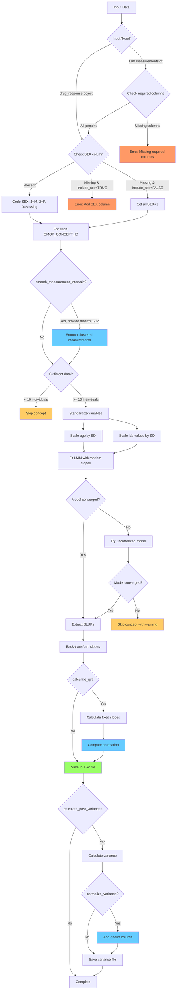

# fganalysis R Package

## Table of Contents

- [Overview](#overview)
- [Package Structure](#package-structure)
  - [R/ Directory Structure](#r-directory-structure)
- [Installation](#installation)
- [Data Access](#data-access)
  - [Configuration](#configuration)
  - [Local Configuration](#local-configuration)
  - [Connecting to Data](#connecting-to-data)
- [Usage](#usage)
  - [Functions](#functions)
- [Examples](#examples)
- [Available Functions](#available-functions)
  - [Data Connection](#data-connection)
  - [Data Retrieval](#data-retrieval)
  - [Covariate Handling](#covariate-handling)
  - [Visualization](#visualization)
  - [Analysis](#analysis)
  - [Output File Naming Convention](#output-file-naming-convention)
  - [Summarization and Output](#summarization-and-output)
  - [BLUP Analysis (Linear Mixed Models)](#blup-analysis-linear-mixed-models)
- [Quality Control and Normalization Functions](#quality-control-and-normalization-functions)
- [Example Workflow](#example-workflow)
- [Using External Lab Values](#using-external-lab-values)
  - [Requirements for External Lab Data](#requirements-for-external-lab-data)
  - [Example: Using External Labs with Drug Response Analysis](#example-using-external-labs-with-drug-response-analysis)
  - [Example: Using External Labs with BLUP Analysis](#example-using-external-labs-with-blup-analysis)
  - [Benefits of Using External Labs](#benefits-of-using-external-labs)
  - [Notes](#notes)
- [Recent Updates](#recent-updates)
  - [New Features](#new-features)
  - [Bug Fixes](#bug-fixes)
- [Development](#development)
  - [Running Tests](#running-tests)
- [Authors](#authors)
- [License](#license)

## Overview

The `fganalysis` is an R package designed for common analyses performed in FinnGen. It provides functions for data processing, summarization, and visualization of lab measurements and drug purchases to study drug response.

## Package Structure

The package is organized into logical modules for better maintainability:

### R/ Directory Structure

- **`connections.R`** - Database connection management
  - `connect_fgdata()` - Establishes connections to FinnGen data sources
  - `create_mock_connection()` - Creates mock connection for testing and development

- **`data_access.R`** - Data retrieval and covariate functions
  - `get_lab_measurements()` - Retrieves lab measurement data
  - `get_drug_purchases()` - Retrieves drug purchase data
  - `get_first_purchase()` - Gets first drug purchase for each individual
  - `join_covariates()` - Joins covariate data to any data frame with FINNGENID
  - `join_covariates_to_labs()` - Joins covariate data specifically to lab measurements

- **`drug_response_core.R`** - Core drug response analysis
  - `drug.response()` - Creates drug response S3 object
  - `create_drug_response()` - Main function for drug response analysis with period annotations
  - `generate_response_summary()` - Summarizes drug responses with baseline/followup metrics and drug purchase metadata
  - `get_measurements_before_drug()` - Retrieves lab measurements before drug purchase for BLUP analysis
  - `get_median_pre_drug()` - Calculates median lab values pre-medication with MAD-based outlier removal

- **`visualization.R`** - Plotting and visualization functions
  - `summarize_drug_response()` - Creates comprehensive summary plots and tables with baseline/followup terminology
  - `plot_lab_value_distribution()` - Violin plot comparison of lab values at baseline and followup
  - `plot_median_pre_drug()` - Generates diagnostic plots for median pre-drug analysis
  - `summarize_drug_purchases_upset()` - UpSet plot for drug combinations

- **`blup_analysis.R`** - BLUP/Linear Mixed Model analysis
  - `calculate_blup_slopes()` - Calculates individual-specific slopes using LMM
  - `summarize_blup_results()` - Summarizes BLUP analysis results

- **`drug_purchase_patterns.R`** - Drug purchase frequency analysis
  - `compute_purchase_frequency()` - Computes intervals between purchases for a single VNR
  - `parallel_compute_purchase_frequencies_for_VNRs()` - Parallel computation of purchase frequencies across multiple VNRs

- **`qc_functions.R`** - Quality control and normalization functions
  - `inverse_rank_normalize()` - Performs inverse rank normalization on numeric vectors
  - `calculate_fixed_slopes()` - Calculates fixed-effect slopes for comparison with BLUPs
  - `process_variance_files()` - Processes variance files with inverse rank normalization
  - `create_variance_summary_table()` - Creates summary statistics table from variance data
  - `generate_variance_plots()` - Generates comparison plots for variance distributions
  - `filter_outliers_mad()` - Removes outliers using Median Absolute Deviation
  - `winsorize_vector()` - Caps extreme values using Winsorization
  - `smooth_measurement_intervals()` - Smooths clustered measurements within specified time intervals

This modular structure makes it easier to maintain, test, and extend the package functionality.

## Installation

To use this package, you can install it from a local source. First, ensure you have the `devtools` package installed in R.

```R
# If devtools is not installed, run this line:
# install.packages("devtools")

# Set MAKEFLAGS for faster compilation if installing from source
Sys.setenv(MAKEFLAGS = "-j4")

## in sandbox

A duckdb, a later version that is loaded will try to load external packages which is not allowed in sandbox.
Therefore first manually install older packages that are compatible with the package

install.packages("/usr/finngen-repos/cran/source/src/contrib/duckdb_1.2.1.tar.gz")
install.packages("/usr/finngen-repos/cran/source/src/contrib/duckdbfs_0.1.0.tar.gz")

library(devtools)
load_all("/finngen/library-green/code/fganalysis/")
conn <- connect_fgdata("/finngen/shared_nfs/Resources/fganalysis/R14/db_config_sb_R14.json")


```

## Data Access

The package accesses data through a centralized connection object. The connection is configured via a JSON file, which specifies the paths to different datasets.

### Configuration

The `connect_fgdata()` function reads a JSON configuration file to set up data sources. A sample configuration file `inst/config/db_config_sb.template.json` looks like this:

```json
{
    "pheno": {
        "path": "/path/to/data/pheno.dirname.parquet",
        "type": "parquet-hive"
    },
    "labs": {
        "path": "/path/to/data/labs.filename.parquet",
        "type": "parquet"
    },
    "minimum": {
        "path": "/path/to/data/minimum.filename.parquet",
        "type": "parquet"
    },
    "cov_pheno": {
        "path": "/path/to/data/cov_pheno.filename.parquet",
        "type": "parquet"
    }
}
```

The package uses `duckdb` to query data stored in the `parquet` format. The connection object returned by `connect_fgdata` contains lazy-loaded `dplyr` tables (`tbl` objects), meaning the data is only loaded into memory when you explicitly perform a query.

The main data tables are:
- **`pheno`**: Longitudinal data from service sector records, including drug purchases.
- **`labs`**: Laboratory measurements from KANTA.
- **`minimum`**: Minimum phenotype data for individuals.
- **`cov_pheno`**: Covariate phenotype data.
- **`endpoint`**: Endpoint data in long format.
- **`vnr`**: [VNR ("Nordic Article Number")](https://wiki.vnr.fi/?page_id=36) medication identification code file.
- **`long_anthropometric`**: Longitudinal anthropometric measurements which is weight, height, blood pressure, smoking and alcohol audits, collected during hospital and primary care visits. See the [relevant FinnGen handbook page](https://docs.finngen.fi/finngen-data-specifics/red-library-data-individual-level-data/what-phenotype-files-are-available-in-sandbox-1/other-registers/hilmo-and-avohilmo-extended-data) for more information.
- **`drug_events`**: Combines KELA reimbursement, KELA purchase and Kanta prescription data. This data is used by default for all drug analyses. For more information see the [handbook page](https://docs.finngen.fi/finngen-data-specifics/red-library-data-individual-level-data/what-phenotype-files-are-available-in-sandbox-1/drug-events).
  

### Local Configuration

For local development, you can create a `inst/config/db_config_local.json` file with paths specific to your environment. This file is automatically ignored by git, so you can customize it without affecting the repository. The package will look for this file first, and fall back to `inst/config/db_config.json` if it doesn't exist.

Example local configuration:
```json
{
    "pheno": {
        "path": "/your/local/path/to/pheno.dirname.parquet",
        "type": "parquet-hive"
    },
    "labs": {
        "path": "/your/local/path/to/labs.filename.parquet",
        "type": "parquet"
    }
}
```

### Connecting to Data

To establish a connection, pass the path to your configuration file to `connect_fgdata`:

```R
# The path can be relative or absolute
# In the FinnGen Sandbox, a pre-configured file is available (see above)
=======
## Usage

### Functions

The package includes several key functions:

- `create_drug_response()`: Generates a drug response dataset based on lab measurements and drug purchases.
- `summarize_drug_response()`: Creates a summary PDF and text tables of drug response data.
- `get_lab_measurements` and `get_drug_purchases` to query for lab values and purchases.

## Examples

Here is a simple example of how to use the package:

```R
# Load the package

load_all("/finngen/shared_nfs/finngen/code/fganalysis/")
# Get connection to data sources. In sandbox, to load the latest data (R14), use
conn <- connect_fgdata("/finngen/shared_nfs/Resources/fganalysis/R14/db_config_sb_R14.json")

# Or using a local config file
conn <- connect_fgdata("inst/config/db_config_local.json")

# For testing or development with small datasets, you can create a mock connection:
# mock_conn <- create_mock_connection(
#   pheno_data = your_pheno_dataframe,
#   labs_data = your_labs_dataframe,
#   cov_pheno_data = your_covariates_dataframe  # optional
# )

## Returned object has attributes that are lazy loaded data frames of different phenotype data.
## You can start writing dplyr queries and e.g. joining to other tables. Nothing will happen before you actually request the data to be localized.
## Behind the scenes, a query engine optimizes the query and returns only the data matching your query.

## Query for individuals with ICD-10 code K51 (IBD)
ibd <- conn$pheno %>%
  filter((SOURCE == "INPAT" | SOURCE == "OUTPAT") & CODE1 == "K51" & ICDVER == "10") %>%
  group_by(FINNGENID) %>%
  summarize(n_diagnoses = n())

## Look at the number of rows
nrow(ibd)
# NA - you get NA because nothing has been queried before you ask for the data.
# Use function collect to execute the query and return results
ibd <- ibd %>% collect()
nrow(ibd)
# 258

## Get all labs with omopid 3007461
labs <- get_lab_measurements(conn$labs, c("3007461"))

## Get all drug purchases with ATC codes starting with L01B
dr <- get_drug_purchases(conn, c("L01B"))

# Create drug response data of lab changes after initiating a drug.
## First define time intervals from drug purchase to summarise lab values
## Here defining pre-measurements drug measurements to be 1 year before drug and
## after period to be 1 month to 1 year.
before_period <- c(-1, 0)
after_period <- c(3/12, 1)


## create a dataframe containing LDL (omopid 3001308) response to first statin purchase (ATC codes starting with C10AA) for each finngen ID  
## you can filter min/max values by providing vector of length 2 specifying min and max lab values values accepted and then removing 3 sd outliers
min_max <- c(0,20)
resp <- create_drug_response(conn,c("3001308"), 
                             druglist=c("C10AA"),before_period,after_period,
                              filter_min_max=min_max,
                              remove_outliers_sd = 3)
## create plots and tables of the response
summarize_drug_response(resp, out_file_prefix="3001308_C10AA_resp")

# Example: Using different summary functions
# Use median for baseline and minimum for followup
resp_median_min <- create_drug_response(
  conn, 
  c("3001308"), 
  druglist = c("C10AA"),
  before_period = before_period,
  after_period = after_period,
  summary_functions = list(summary_median, summary_min),
  filter_min_max = min_max,
  remove_outliers_sd = 3
)

# Example: Using closest-to-drug measurements for both periods
resp_closest <- create_drug_response(
  conn,
  c("3001308"),
  druglist = c("C10AA"),
  before_period = before_period,
  after_period = after_period,
  summary_functions = list(summary_closest_to_drug, summary_closest_to_drug),
  filter_min_max = min_max
)

# Example: Custom summary function (e.g., 75th percentile)
summary_q75 <- function(lab_values) {
  quantile(lab_values$VALUE, probs = 0.75, na.rm = TRUE)
}

resp_custom <- create_drug_response(
  conn,
  c("3001308"),
  druglist = c("C10AA"),
  before_period = before_period,
  after_period = after_period,
  summary_functions = list(summary_median, summary_q75)
)
```

The returned `conn` object is a `fg_data_connection` object, and you can access the data tables as its attributes (e.g., `conn$pheno`, `conn$labs`).

## Available Functions

This package provides a suite of functions for drug response analysis.

### Data Connection
- **`connect_fgdata(path_to_conf)`**: Connects to the databases specified in the JSON configuration file and returns a `fg_data_connection` object.
- **`create_mock_connection(pheno_data, labs_data, ...)`**: Creates a mock connection object using data frames instead of database connections. Useful for testing, development, and working with small datasets that can fit in memory.

### Data Retrieval
- **`get_lab_measurements(all_labs, lablist, require_values = TRUE, return_cols = c("FINNGENID","OMOP_CONCEPT_ID", "EVENT_AGE", "VALUE"), finngen_ids = NULL, lazy = FALSE)`**: Extracts lab measurements for specified OMOP concept IDs.
  - `require_values`: If TRUE, only returns rows with non-missing VALUE
  - `return_cols`: Columns to return from the lab data
  - `finngen_ids`: Optional vector of FINNGENIDs to filter the data
  - `lazy`: If TRUE, returns a lazy tbl object instead of collecting data
- **`get_drug_purchases(all_phenos, druglist, finngen_ids = NULL, return_cols = c("FINNGENID","EVENT_AGE", ATC="CODE1", REIMB_CODE="CODE2", VNR="CODE3", N_PACKS="CODE4"), lazy = FALSE)`**: Extracts drug purchases for specified ATC codes. The matching is done on the beginning of the ATC code.
- **`get_first_purchase(all_phenos, druglist, finngen_ids = NULL, return_cols = c("FINNGENID","EVENT_AGE","CODE1"), lazy = FALSE)`**: A wrapper around `get_drug_purchases` to get only the first purchase event for each individual.

### Covariate Handling
The package follows the **single responsibility principle** for covariate handling. Core functions focus on their primary purpose, while covariate joining is handled by dedicated helper functions.

- **`join_covariates_to_labs(lab_data, covariates, covariate_cols)`**: Helper function to join covariate data to lab measurements data frame. This function handles the common pattern of adding covariates like sex, age, etc. to lab data.
- **`join_covariates(data, covariates, covariate_cols)`**: Generic helper function to join covariate data to any data frame with FINNGENID column.

**Benefits of this approach:**
- **Single Responsibility**: Each function has one clear purpose
- **Composability**: Functions can be combined in different ways
- **Flexibility**: Users can choose when/how to join covariates
- **Testability**: Easier to test individual components
- **Maintainability**: Less complex functions are easier to maintain

### Visualization
- **`plot_median_pre_drug(measurements_before_mad, measurements_after_mad, output_dir = ".", output_file_prefix = "", sex_cols = c("SEX", "SEX_IMPUTED"))`**: Generates diagnostic plots for median pre-drug analysis, including distribution plots before and after MAD outlier removal, and sex-stratified violin plots. This function is designed to work with the output from `get_median_pre_drug` or similar data structures.

### Summary Functions for Drug Response Analysis
These functions are used with the `summary_functions` parameter in `create_drug_response()` to control how lab measurements are aggregated for baseline and followup periods:

- **`summary_median(lab_values)`**: Returns the median of all measurements in a period. This is the default and most robust option for typical analyses.
- **`summary_min(lab_values)`**: Returns the minimum value in a period. Useful when you want to capture the best response (e.g., lowest LDL cholesterol after statin treatment).
- **`summary_closest_to_drug(lab_values)`**: Returns the measurement closest in time to drug initiation. Useful when timing relative to treatment start is important, or when you want to minimize the effect of long-term trends.

**Custom Functions**: You can also create your own summary functions. They must:
- Accept a data frame `lab_values` with columns including `VALUE` and `time_to_first_drug`
- Return a single numeric value
- Example: `summary_max <- function(lab_values) { max(lab_values$VALUE, na.rm = TRUE) }`

### Analysis
- **`create_drug_response(conn, lablist, druglist, before_period, after_period, summary_functions = list(summary_median, summary_median), filter_min_max = c(-Inf, Inf), use_lab_free_text_values = TRUE, use_only_reimbursement_drugs = FALSE, finngen_ids = NULL, remove_outliers_sd = NULL, external_labs = NULL)`**: The main analysis function. It calculates the drug response based on lab value changes before and after the first drug purchase. Returns a `drug.response` object containing:
  - Response data with baseline/followup measurements and drug purchase metadata
  - Lab measurements annotated with time periods (`lab_period`: Before_Baseline, Baseline, Followup, Between_Baseline_and_Followup, After_Followup)
  - Drug purchases annotated with time periods (`purchase_period`)
  - **`summary_functions`**: A list of two functions to summarize lab measurements for baseline and followup periods respectively. The package provides three built-in functions:
    - **`summary_median`** (default): Calculates the median of all measurements in the period
    - **`summary_min`**: Calculates the minimum value in the period
    - **`summary_closest_to_drug`**: Selects the measurement closest in time to drug initiation
    - You can also provide custom functions that accept a data frame of lab measurements and return a single numeric value
    - Example: `summary_functions = list(summary_median, summary_min)` uses median for baseline and minimum for followup
  - The `remove_outliers_sd` parameter can be used to remove outliers (specify number of SDs from mean, e.g., 1-6)
  - The `external_labs` parameter allows you to supply your own lab measurements instead of using Kanta lab values (see "Using External Lab Values" section below)
- **`generate_response_summary(lab_measurements, drug_purchases, before_period, after_period, summary_functions = list(summary_median, summary_median))`**: A helper function to calculate the summary statistics for the response (e.g., median value before and after treatment). Called by `create_drug_response`. The function:
  - Requires `lab_measurements` with `time_to_first_drug` and `lab_period` columns
  - Requires `drug_purchases` with `time_to_first_drug` and `purchase_period` columns  
  - Calculates baseline/followup lab summaries (`n_baseline`, `n_followup`, `baseline`, `followup`)
  - Calculates drug purchase summaries (`n_purchases_baseline`, `n_purchases_followup`, `total_ddd_followup`)
  - The `summary_functions` parameter allows using different summary statistics (default is list with median for both periods)
- **`get_measurements_before_drug(conn, lablist, druglist, months_before = 3, remove_outliers_sd = NULL, winsorize_pct = NULL, range_sd_filter = NULL, external_labs = NULL)`**: A standalone function to retrieve lab measurements, specifically designed for preparing data for BLUP analysis. It filters measurements to a specified window before a drug purchase for exposed individuals and includes all measurements for unexposed individuals.
  - `conn`: A `fg_data_connection` object.
  - `lablist`: A character vector of OMOP concept IDs for the labs of interest.
  - `druglist`: A character vector of ATC drug codes to define the "exposed" cohort.
  - `months_before`: The time window in months before the first drug purchase to include lab measurements (default is 3).
  - `remove_outliers_sd`: Optional parameter to remove outliers based on standard deviation (e.g., `remove_outliers_sd = 4`).
  - `winsorize_pct`: Optional parameter to cap extreme values using Winsorization. Values between 0 and 0.5 specify the percentage to winsorize on each tail (e.g., `winsorize_pct = 0.05` caps values below the 5th percentile and above the 95th percentile). This is a percentage to winsorise on each tail which is equivalent of (1- `winsorize_pct`) proportion to keep:
      - insorize_pct = 0.01 → Caps at 1st and 99th percentiles (1% on each tail)
      - winsorize_pct = 0.05 → Caps at 5th and 95th percentiles (5% on each tail)
      - winsorize_pct = 0.10 → Caps at 10th and 90th percentiles (10% on each tail)
  - `range_sd_filter`: An optional parameter for robust outlier removal. It takes a list with three named elements: `lower_bound`, `upper_bound`, and `nsd`. The function calculates the mean and standard deviation on the subset of data within the specified bounds and then removes all values from the original data that are more than `nsd` standard deviations from that calculated mean. This is useful for removing extreme outliers without them skewing the statistics used for the filtering itself. Example: `range_sd_filter = list(lower_bound = 50, upper_bound = 200, nsd = 4)`.
  - `external_labs`: Optional parameter to supply your own lab measurements instead of using Kanta lab values (see "Using External Lab Values" section below).
   Note: Only one outlier removal method (`remove_outliers_sd`, `winsorize_pct`, or `range_sd_filter`) should be used at a time.

- **`get_median_pre_drug(conn, lablist, druglist, months_before = 1, remove_outliers_mad_th = 5, output_dir = ".", output_file_prefix = "")`**: Calculates median lab values pre-medication with MAD-based outlier removal.
  - Outputs tab-delimited files (`{output_file_prefix}_{OMOP_CONCEPT_ID}_DF13_median.tsv`) with columns: FID, IID, and {OMOP_CONCEPT_ID}_median
  - Uses Median Absolute Deviation (MAD) for robust outlier removal with threshold parameter
  - For diagnostic plots, use the separate `plot_median_pre_drug` function

### Output File Naming Convention
To avoid file conflicts when running both BLUP and median analyses:
- **BLUP output files**: `{output_file_prefix}_{OMOP_CONCEPT_ID}_DF13_blup.tsv`
- **BLUP model files**: `{output_file_prefix}_{OMOP_CONCEPT_ID}_blup_model.rds`
- **BLUP description files**: `{output_file_prefix}_{OMOP_CONCEPT_ID}_DF13_blup_descriptionfile.tsv`
- **Median output files**: `{output_file_prefix}_{OMOP_CONCEPT_ID}_DF13_median.tsv`
- **Median description files**: `{output_file_prefix}_{OMOP_CONCEPT_ID}_DF13_median_descriptionfile.tsv`

### Summarization and Output
- **`summarize_drug_response(drug_response, out_file_prefix)`**: Generates a PDF report with plots and tables summarizing the drug response analysis.
- **`summarize_drug_purchases_upset(drug_response, out_file_prefix)`**: Generates a PDF file containing an UpSet plot to visualize the intersections of drug purchases.
- **`drug.response(...)`**: This is not a function to be called directly by the user, but rather the S3 object class that holds the results from `create_drug_response`. It's a list containing:
  - `responses`: Response data with columns including `baseline`, `followup`, `response`, `n_baseline`, `n_followup`, drug purchase information (`n_purchases_baseline`, `n_purchases_followup`, `total_ddd_followup`), and extended drug details (VNR, package size, dosage, DDD per pack)
  - `all_measurements`: All lab measurements with `time_to_first_drug` and `lab_period` annotations
  - `all_drug_purchases`: All drug purchases with `time_to_first_drug` and `purchase_period` annotations  
  - `lab_response_period`: The time periods (baseline and followup) used for the analysis
- **`plot_lab_value_distribution(drug_response, remove_outliers = FALSE)`**: Creates and returns a `ggplot` object containing violin plots (with overlaid boxplots) that compare the distribution of lab values at baseline and followup relative to the first drug purchase. The plot is faceted by drug type and includes statistical significance tests. Uses violin plots with consistent ordering ("Baseline" always on the left in teal #00AFBB, "Followup" always on the right in gold #E7B800) and ggpubr styling.

### BLUP Analysis (Linear Mixed Models)
- **`calculate_blup_slopes(data, output_dir = ".", min_measurements = 2, include_sex = TRUE, debug_dir = NULL, drug_exposed_only = FALSE, calculate_post_variance = FALSE, calculate_qc = FALSE, normalize_variance = FALSE, save_model = FALSE, plot_blup_correlation = FALSE, output_file_prefix = NULL, smooth_measurement_intervals = NULL)`**: Implements a linear mixed model (LMM) to calculate Best Linear Unbiased Predictors (BLUPs) for individual-specific slopes of lab value changes over age. This follows the methodology from [Wiegrebe et al. (2024) Nature Communications](https://www.nature.com/articles/s41467-024-54483-9). The function:
  - **NEW**: Accepts either a `drug.response` object OR a data frame with lab measurements (must contain: FINNGENID, OMOP_CONCEPT_ID, EVENT_AGE, VALUE)
  - Fits a model: `lab_value ~ sex + age + (age | FINNGENID)` with random intercepts and slopes
  - Sex is coded according to the PLINK/REGENIE standard (1=Male, 2=Female, 0=Missing/Unknown)
  - If `include_sex = TRUE` (default), the function expects a SEX column in the drug_response object. If not found, it will raise an error with instructions to use `create_drug_response()` with appropriate covariates
  - If `include_sex = FALSE`, all subjects are coded as male (1) and sex is not included in the model
  - Includes robust convergence handling: scales age for numerical stability and falls back to simpler models if needed
  - Outputs tab-delimited files (`{OMOP_CONCEPT_ID}_DF13_blup.tsv`) with columns: FID, IID, and {OMOP_CONCEPT_ID}_slope
  - **NEW: Quality Control Features**:
    - When `calculate_qc = TRUE`: Calculates fixed-effect slopes for comparison with BLUPs and reports correlation
    - When `normalize_variance = TRUE`: Adds quantile-normalized variance column to variance output files
    - QC correlation helps validate that random effects are capturing individual variation appropriately
  - **NEW: Model Saving and Visualization**:
    - When `save_model = TRUE`: Saves the fitted lmer model object as an RDS file (`{OMOP_CONCEPT_ID}_model.rds`)
    - When `plot_blup_correlation = TRUE`: Creates a scatter plot comparing BLUP slopes with fixed-effect slopes, including correlation coefficient, p-value, and regression line with confidence interval (requires `ggpubr` package)
    - Plot uses `theme_bw()` and is saved as `{OMOP_CONCEPT_ID}_blup_correlation.pdf`
  - **NEW: Interval Smoothing**:
    - The `smooth_measurement_intervals` parameter accepts a numeric value (1-12) to smooth clustered measurements that are less than the specified number of months apart by replacing them with a single representative measurement (mean age, median value). This can produce more stable estimates of long-term trajectories.
  - Returns a list with model details and BLUP estimates for each lab measurement type

#### Scaling and Back-transformation Note
To improve model convergence, the function standardizes both age and lab values:
- **Scaling**: Both variables are centered (mean-subtracted) and divided by their standard deviations
  - `age_scaled = (age - mean(age)) / sd(age)`
  - `lab_scaled = (lab - mean(lab)) / sd(lab)`
- **Model fitting**: The LMM is fitted on scaled data, producing slopes in units of SD(lab)/SD(age)
- **Back-transformation**: Slopes are converted to original units (lab value change per year):
  - `original_slope = scaled_slope × (sd(lab) / sd(age))`
- This approach maintains numerical stability while preserving interpretability

#### BLUP Analysis Workflow



- **`summarize_blup_results(blup_results)`**: Provides summary statistics (mean, SD, min, max) for the BLUP slopes from each OMOP concept.

### Quality Control and Normalization Functions
- **`inverse_rank_normalize(x)`**: Performs inverse rank normalization on a numeric vector, transforming it to follow a standard normal distribution while preserving rank order.
- **`calculate_fixed_slopes(data, min_measurements = 2)`**: Calculates individual-specific slopes using simple linear regression (fixed effects only) for comparison with BLUP estimates.
- **`process_variance_files(output_dir = ".", generate_plots = FALSE, save_normalized = TRUE)`**:
  - Reads all `*_variance.tsv` files in the specified directory
  - Adds inverse rank normalized variance columns
  - Generates summary statistics for both original and normalized values
  - Optionally creates comparison plots showing distributions before/after normalization
  - Saves files with `_qnorm.tsv` suffix containing the normalized data
- **`create_variance_summary_table(summary_list)`**: Creates a summary table from processed variance data with statistics for both original and normalized values
- **`generate_variance_plots(summary_list)`**: Generates comparison plots showing distributions of original and normalized variance data
- **`filter_outliers_mad(x, th = 3)`**: Removes outliers from a numeric vector based on Median Absolute Deviation (MAD), a robust alternative to standard deviation-based methods
- **`winsorize_vector(x, winsorize_pct = 0.01)`**: Caps extreme values at specified percentiles to mitigate outlier influence without removing data points
- **`smooth_measurement_intervals(df, min_interval_months = 6)`**: Smooths clustered measurements by replacing measurements closer than the specified interval with representative values (mean age, median value)

## Example Workflow

Here is a complete example of how to use the package to analyze the effect of statins (ATC code `A10`) on LDL cholesterol levels (OMOP ID `3001308`).

```R
# 1. Load the package
library(fganalysis)

# 2. Connect to the data sources
#    (replace with the correct path to your config file)
conn <- connect_fgdata("config/db_config.json")

# The conn object contains lazy-loaded tables.
# You can use dplyr verbs on them. The query is executed only when you `collect()`.
# For example, count IBD diagnoses:
ibd_counts <- conn$pheno %>%
  filter((SOURCE == "INPAT" | SOURCE == "OUTPAT") & CODE1 == "K51" & ICDVER == "10") %>%
  group_by(FINNGENID) %>%
  summarise(n_diagnoses = n()) %>%
  collect()

print(head(ibd_counts))


# 3. Define parameters for drug response analysis
#    - Lab ID for LDL
#    - ATC code for statins
#    - Time windows for baseline (before drug) and followup (after drug) measurements
lab_id <- c("3001308")
drug_codes <- c("A10")
before_window <- c(-1, 0)      # 1 year before to drug purchase (baseline period)
after_window <- c(1/12, 1)   # 1 month to 1 year after drug purchase (followup period)

# 4. Run the drug response analysis
#    This function will:
#    - Get the relevant lab measurements and drug purchases.
#    - Find the first drug purchase for each individual.
#    - Annotate measurements and purchases with period labels (Baseline, Followup, etc.)
#    - Calculate the difference in median lab values between the baseline and followup periods.
#    - Calculate drug purchase metadata (counts, total DDD) during different periods.
response_data <- create_drug_response(
  conn = conn,
  lablist = lab_id,
  druglist = drug_codes,
  before_period = before_window,
  after_period = after_window
  # Optionally remove outliers: remove_outliers_sd = 3
)

# Add covariates using helper functions (if needed for BLUP analysis)
response_data$responses <- join_covariates(
  data = response_data$responses,
  covariates = conn$cov_pheno,
  covariate_cols = c("SEX", "AGE_AT_DEATH_OR_END_OF_FOLLOWUP")
)

response_data$all_measurements <- join_covariates_to_labs(
  lab_data = response_data$all_measurements,
  covariates = conn$cov_pheno,
  covariate_cols = c("SEX", "AGE_AT_DEATH_OR_END_OF_FOLLOWUP")
)

# 5. Summarize the results
#    This will create a PDF file with plots and text files with summary tables.
summarize_drug_response(response_data, out_file_prefix = "statin_ldl_response_summary")

# 6. (Optional) Generate an UpSet plot of drug purchase combinations
#    This visualizes which drug combinations are most common among the cohort.
summarize_drug_purchases_upset(response_data, out_file_prefix = "statin_purchase_combinations")

# 7. (Optional) Create a boxplot of lab value distributions
#    This function returns a ggplot object that can be printed or saved.
lab_distribution_plot <- plot_lab_value_distribution(response_data, remove_outliers = TRUE)

# Print the plot to the active graphics device
print(lab_distribution_plot)

# Or save it to a file
ggsave("statin_ldl_distribution.pdf", plot = lab_distribution_plot, width = 10, height = 8)

# 8. (Optional) Calculate BLUP slopes for longitudinal trajectories
#    This estimates individual-specific rates of lab value change over age
#    Note: SEX data must be included in the drug_response object via create_drug_response()
blup_results <- calculate_blup_slopes(response_data,
                                      output_dir = "blup_output",
                                      calculate_qc = TRUE,  # NEW: Calculate QC metrics
                                      normalize_variance = TRUE,  # NEW: Add qnorm to variance files
                                      save_model = TRUE,  # NEW: Save fitted lmer models
                                      plot_blup_correlation = TRUE)  # NEW: Create BLUP vs OLS correlation plots

# Summarize the BLUP results
blup_summary <- summarize_blup_results(blup_results)
print(blup_summary)

# NEW: Access saved models and correlation information
for (concept_id in names(blup_results)) {
  result <- blup_results[[concept_id]]

  # Check if model was saved
  if (!is.null(result$model_file)) {
    cat("Model saved to:", result$model_file, "\n")
    # Load the model if needed
    # saved_model <- readRDS(result$model_file)
  }

  # Check if correlation plot was created
  if (!is.null(result$plot_file)) {
    cat("Correlation plot saved to:", result$plot_file, "\n")
  }

  # Access correlation statistics
  if (!is.null(result$blup_fixed_correlation)) {
    cat("BLUP-OLS correlation for", concept_id, ":\n")
    cat("  r =", round(result$blup_fixed_correlation$correlation, 3), "\n")
    cat("  p =", format.pval(result$blup_fixed_correlation$p_value), "\n")
    cat("  n =", result$blup_fixed_correlation$n_pairs, "pairs\n")
  }
}

# 8b. Calculate BLUP slopes directly from lab measurements
#     This allows BLUP analysis without drug response analysis
# Option 1: Pull lab measurements with covariates using the new functionality
lab_measurements <- get_lab_measurements(conn$labs,
                                         lablist = c("3001308", "3027114"),  # LDL and HDL
                                         require_values = TRUE,
                                         covariates = conn$cov_pheno,
                                         covariate_cols = c("SEX", "AGE_AT_DEATH_OR_END_OF_FOLLOWUP"))

# Calculate BLUPs directly with SEX included and new features
blup_results_direct <- calculate_blup_slopes(lab_measurements,
                                             output_dir = "blup_output_direct",
                                             include_sex = TRUE,
                                             calculate_qc = TRUE,
                                             save_model = TRUE,
                                             plot_blup_correlation = TRUE)

# Option 2: If you don't need covariates, you can skip them
lab_measurements_no_cov <- get_lab_measurements(conn$labs,
                                                 lablist = c("3001308", "3027114"),
                                                 require_values = TRUE)

# Calculate BLUPs without sex adjustment
blup_results_no_sex <- calculate_blup_slopes(lab_measurements_no_cov,
                                              output_dir = "blup_output_direct",
                                              include_sex = FALSE,  # Must be FALSE without SEX column
                                              calculate_qc = TRUE)

# 8c. Get measurements before drug purchase for BLUP analysis
# This standalone function is the recommended way to prepare data for BLUP analysis,
# as it handles filtering before a drug purchase and outlier removal in a single step.

# Example 1: Using standard deviation for outlier removal
measurements_for_blup_sd <- get_measurements_before_drug(
  conn = conn,
  lablist = c("3001308"), # LDL
  druglist = c("C10AA"),  # Statins
  months_before = 3,     # 3 month window before first purchase
  remove_outliers_sd = 4  # Remove values > 4 SD from the mean
)

# Add covariates using helper function
measurements_for_blup_sd <- join_covariates_to_labs(
  lab_data = measurements_for_blup_sd,
  covariates = conn$cov_pheno,
  covariate_cols = c("SEX")
)

# Example 2: Using Winsorizing for outlier removal
measurements_before_drug_purchase <- get_measurements_before_drug(
  conn = conn,
  lablist = c("3001308"),
  druglist = c("C10AA"),
  months_before = 3,
  winsorize_pct = 0.05 # Cap values at the 5th and 95th percentiles
)

# Add covariates using helper function
measurements_before_drug_purchase <- join_covariates_to_labs(
  lab_data = measurements_before_drug_purchase,
  covariates = conn$cov_pheno,
  covariate_cols = c("SEX")
)

# NEW Example 3: Using range-based SD filter for robust outlier removal
measurements_for_blup_ranged <- get_measurements_before_drug(
  conn = conn,
  lablist = c("3001308"),
  druglist = c("C10AA"),
  months_before = 3,
  range_sd_filter = list(lower_bound = 1, upper_bound = 8, nsd = 4)
)

# Add covariates using helper function
measurements_for_blup_ranged <- join_covariates_to_labs(
  lab_data = measurements_for_blup_ranged,
  covariates = conn$cov_pheno,
  covariate_cols = c("SEX")
)

# The resulting dataframe can be passed directly to calculate_blup_slopes()
# blup_results <- calculate_blup_slopes(
#   data = measurements_for_blup_sd,
#   output_dir = "blup_output"
# )

# 8d. (NEW) Example of using interval smoothing for BLUP calculation
blup_results_smoothed <- calculate_blup_slopes(
  data = measurements_for_blup_sd,
  output_dir = "blup_output_smoothed",
  smooth_measurement_intervals = 6 # Activate smoothing for measurements < 6 months apart
)

# 9. (Optional) Process variance files with inverse rank normalization
#    This creates summary statistics and comparison plots
variance_summary <- process_variance_files(output_dir = "blup_output",
                                           generate_plots = TRUE,
                                           save_normalized = TRUE)
print(variance_summary)

# 10. (Optional) Median pre-drug analysis with separated plotting
#     This demonstrates the new separated approach following single responsibility principle

# Get measurements before drug purchase
measurements_before_mad <- get_measurements_before_drug(
  conn = conn,
  lablist = c("3001308"), # LDL
  druglist = c("C10AA"),  # Statins
  months_before = 1
)

# Apply MAD outlier removal
measurements_after_mad <- measurements_before_mad %>%
  filter(VALUE %in%
         filter_outliers_mad(VALUE, th = 5))

# Calculate median values (data processing only)
median_results <- get_median_pre_drug(
  conn = conn,
  lablist = c("3001308"),
  druglist = c("C10AA"),
  months_before = 1,
  remove_outliers_mad_th = 5,
  output_dir = "median_output",
  output_file_prefix = "statin_ldl"
)

# Generate diagnostic plots (separate function)
plot_median_pre_drug(
  measurements_before_mad = measurements_before_mad,
  measurements_after_mad = measurements_after_mad,
  output_dir = "median_output",
  output_file_prefix = "statin_ldl"
)
```

This will produce files like `statin_ldl_response_summary.pdf`, `statin_ldl_response_summary_responses_by_drug.txt`, etc., in your working directory.

## Using External Lab Values

The package now supports using external lab measurements instead of the default Kanta lab values. This is useful when you have lab data from other sources or when you want to use preprocessed lab measurements.

### Requirements for External Lab Data

External lab data must be provided as a data frame with the following required columns:
- **`FINNGENID`**: Individual identifier
- **`OMOP_CONCEPT_ID`**: Lab measurement concept ID
- **`EVENT_AGE`**: Age at measurement
- **`VALUE`**: Lab value (numeric)

### Example: Using External Labs with Drug Response Analysis

```R
# Create or load your external lab data
# here we are getting weights from finngen extended hilmo/avohilmo/primaryu dat

weights <- conn$long_anthropometric %>% filter(!is.na(WEIGHT)) %>%
            mutate(OMOP_CONCEPT_ID="WEIGHT", VALUE=WEIGHT) %>%
  select(FINNGENID, OMOP_CONCEPT_ID, EVENT_AGE, VALUE) %>% collect()


## glp1 analog effect on weight
resp_weight <- create_drug_response(conn, c("WEIGHT"),
                             druglist=c("A10BJ"),before_period,after_period,
                             external_labs = weights )
summarize_drug_response(resp_weight, out_file_prefix="glp1_weight")


# The rest of the workflow is the same
summarize_drug_response(response_data, out_file_prefix = "external_lab_response")
```

### Example: Using External Labs with BLUP Analysis

```R
# Create or load your external lab data
external_labs <- data.frame(
  FINNGENID = rep(paste0("FG", 1:20), each = 5),
  OMOP_CONCEPT_ID = "3001308",
  EVENT_AGE = rep(seq(30, 70, length.out = 5), 20) + rnorm(100, 0, 2),
  VALUE = rnorm(100, 150, 20)
)

# Get measurements before drug using external labs
measurements <- get_measurements_before_drug(
  conn = conn,
  lablist = c("3001308"),
  druglist = c("C10AA"),
  months_before = 12,
  external_labs = external_labs  # Use external lab data
)

# Add covariates if needed
measurements <- join_covariates_to_labs(
  lab_data = measurements,
  covariates = conn$cov_pheno,
  covariate_cols = c("SEX")
)

# Calculate BLUP slopes
blup_results <- calculate_blup_slopes(
  data = measurements,
  output_dir = "blup_output",
  include_sex = TRUE
)
```

### Benefits of Using External Labs

- **Flexibility**: Use lab data from any source, not just Kanta
- **Preprocessing**: Apply custom preprocessing or quality control before analysis
- **Integration**: Combine lab data from multiple sources
- **Compatibility**: Works seamlessly with all existing analysis functions

### Notes

- When `external_labs` is provided, the `use_lab_free_text_values` parameter is ignored
- External labs are automatically filtered by `lablist` and `finngen_ids` (if provided)
- All other parameters (outlier removal, filtering, etc.) work the same way
- The connection object is still required for drug purchase data

## Recent Updates

### New Features (Current Branch vs Master)

#### Flexible Summary Functions for Drug Response Analysis
The `create_drug_response()` and `generate_response_summary()` functions now support customizable summary functions for baseline and followup periods:

- **`summary_functions` Parameter**: A list of two functions to independently control how baseline and followup measurements are aggregated
  - First function is applied to baseline period measurements
  - Second function is applied to followup period measurements
  - Default: `list(summary_median, summary_median)`

- **Built-in Summary Functions**:
  - **`summary_median(lab_values)`**: Returns the median of all measurements in a period (default)
  - **`summary_min(lab_values)`**: Returns the minimum value in a period
  - **`summary_closest_to_drug(lab_values)`**: Returns the measurement closest in time to drug initiation (uses `time_to_first_drug` column)

- **Custom Functions**: Users can provide their own summary functions that:
  - Accept a data frame of lab measurements for an individual
  - Return a single numeric value
  - Example: `summary_q75 <- function(lab_values) { quantile(lab_values$VALUE, probs = 0.75, na.rm = TRUE) }`

- **Flexible Combinations**: Different functions can be used for baseline vs followup
  - Example: `summary_functions = list(summary_median, summary_min)` uses median for baseline and minimum for followup
  - This allows testing different response definitions (e.g., median baseline vs. minimum followup)

#### Enhanced Drug Purchase Information and Period Tracking
This branch adds comprehensive drug purchase metadata and harmonizes period terminology across the package:

- **Drug Purchase Metadata**: The `responses` data frame now includes:
  - `n_purchases_baseline`: Number of drug purchases during the baseline period
  - `n_purchases_followup`: Number of drug purchases during the followup period  
  - `total_ddd_followup`: Total Defined Daily Dose (DDD) purchased during followup period
  - `n_purchases_after_followup`: Number of purchases after the followup period
  - Extended drug details: `first_drug_vnr`, `first_drug_package_size`, `first_drug_dosage`, `first_drug_dosage_unit`, `first_drug_ddd_per_pack`

- **Period Annotations**: Both lab measurements and drug purchases now include period labels:
  - Lab measurements have `lab_period` column
  - Drug purchases have `purchase_period` column
  - Possible period values: `"Before_Baseline"`, `"Baseline"`, `"Followup"`, `"Between_Baseline_and_Followup"`, `"After_Followup"`

- **Terminology Harmonization**: Consistent naming throughout the package:
  - Changed from "before/after" to "baseline/followup" in all outputs
  - Column name changes in response data:
    - `n_before` → `n_baseline`
    - `n_after` → `n_followup`
    - `before` → `baseline`
    - `after` → `followup`
  - Updated `time_to_drug` → `time_to_first_drug` for clarity
  - Updated function signatures: `generate_response_summary()` now requires `drug_purchases` parameter

- **Data Processing Updates**:
  - `get_drug_purchases()` now renames `MEDICATION_QUANTITY` to `N_PACKS` when using combined drug events
  - Scripts updated to include `MEDICATION_QUANTITY` in processed drug events

#### Previous Features

- **External Lab Values Support**: Added `external_labs` parameter to `create_drug_response()` and `get_measurements_before_drug()` functions, allowing users to supply their own lab measurements instead of using Kanta lab values.

### Bug Fixes
- **Fixed config file key**: Corrected `"cov_pheno:"` (with trailing colon) to `"cov_pheno"` in `db_config_sb.json`
- **Fixed `get_lab_measurements` covariate handling**: The function now correctly handles covariate columns by only selecting them from the appropriate table after joining. Previously, the function would error if covariate columns didn't exist in the lab data table.

## Development

Contributions and improvements are welcome.

### Generating data files for new releases
The `scripts/` folder provides (bash) shell scripts that can generate the required .parquet files and a template "file locations" file from which the shell script reads the input file paths. Typically, new release files should be generated in refinery and then copied into the red library so that they can be accessed in sandbox. However, if needed, a script is provided to perform the conversion within the sandbox environment.

#### Outside of the FinnGen sandbox
The script `scripts/prepare_data_refinery.sh` is written for use outside of the sandbox environment and copies the required files from Google Cloud buckets. The bash script assumes that `duckdb` and `python` (3.0 or higher) are already installed on the system and requires a file specifying the bucket path (starting with `gs://`) of the needed input files. A template file `scripts/file_locations_rX.template.txt` can be used to specify the bucket paths.

To use this script:
1. Ensure `duckdb`, `python` (v3.0 or higher) and `R` (with libraries `dplyr`, `ggplot2` and `data.table`) are installed
2. Copy `scripts/prepare_data_refinery.sh` to your chosen directory
3. Copy `scripts/process_hilmo_avohilmo.R` and `scripts/process_drugs.R` to your chosen directory
4. Copy `file_locations_rX.template.txt` to your chosen directory and edit with the location of the required input files
5. Edit the line starting with `source` in your copied `prepare_data_refinery.sh` so that it sources the edited file locations file
6. `cd` to your chosen directory (if not already there), add exectutable permission to your copied `prepare_data_refinery.sh` and run using `./prepare_data_refinery.sh`. Depending on system resources and download speed, the process may take several hours.
7. Once the required (.parquet and .tsv) files are generated, upload them to the relevant bucket and use the config template at `inst/config/db_config.template.json` to create an updated config file.

#### Within FinnGen sandbox
The script `prepare_data_sandbox.sh` is intended for use within the FinnGen sandbox environment. As `duckdb` is not currently installed, it requires that the `duckdb` R library is installed (see [Installation](#installation)) and that the user has sufficient space to create the output files (~10GB as of R14).

To use this script:
1. Create an instance of the largest virtual machine (16 CPUs, 128 GB memory)
2. Ensure that R libraries `duckdb`, `dplyr`, `ggplot2` and `data.table` are installed
3. Copy `prepare_data_sandbox.sh`, `process_hilmo_avohilmo.R`, `process_drugs.R` and `file_locations_rX.template.txt` from `/finngen/shared_nfs/finngen/code/fganalysis/scripts/` to your chosen directory
4. Edit the copied `file_locations_rX.template.txt` to point to the input files corresponding to the latest release
5. Edit the line starting with `source` in your copied `prepare_data_sandbox.sh` so that it sources the edited file locations file
6. In the terminal, `cd` to your chosen directory (if not already there), add exectutable permission to your copied `prepare_data_sandbox.sh` and run using `./prepare_data_sandbox.sh`. The script may take up to 3 hours to run. 
7. Copy the output .parquet and .tsv files to `/finngen/shared_nfs/Resources/fganalysis/RX/`, where `X` is the release number (create the directory first if it doesn't exist)
8. Create a copy of `/finngen/shared_nfs/finngen/code/fganalysisinst/config/db_config_sb.template.json` and name it `db_config_sb_rX.json` (where `X` is the release number), then edit the paths to point to the files copied in the previous step. Then copy `db_config_sb_rX.json` to `/finngen/shared_nfs/Resources/fganalysis/RX/`.

### Running Tests

The package uses `testthat` for unit tests. To run the tests, use:

```R
devtools::test()
```

When adding new functionality, please add corresponding unit tests in the `tests/testthat/` directory.

## Authors

- **Mitja Kurki, PhD** (Author, Creator) - <mkurki@broadinstitute.org>
- **Samuel Jones, PhD** (Maintainer, Contributor) - <samuel.jones@helsinki.fi>
- **Reza Jabal, PhD** (Contributor) - <rjabal@broadinstitute.org>
- **Arto Lehisto, MSc** (Contributor) - <arto.lehisto@helsinki.fi>

## License

This package is licensed under the MIT License.
